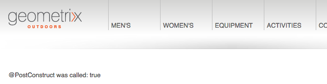

# Sling Model Test

This application demonstrates the use of Sling Models and the @PostConstruct annotation in AEM 6.1.

The package containing the Sling Model is defined in the `maven-bundle-plugin` properties
```
<Sling-Model-Packages>
  com.github.mickleroy.models
</Sling-Model-Packages>
```

The Sling Model class simply sets a variable to `true` in the init method annotated with `@PostConstruct`
```
@Model(adaptables = Resource.class)
public class SampleModel {
    
    private boolean postContructCalled = false;
    
    @PostConstruct
    public void init() {
        this.postContructCalled = true;
    }

    public boolean isPostContructCalled() {
        return this.postContructCalled;
    }
}
```

The Sling Model is used in a simple HTL component that outputs the value of `postConstructCalled`
```
<sly data-sly-use.model="com.github.mickleroy.models.SampleModel">
	<p>@PostConstruct was called: ${model.postContructCalled}</p>
</sly>
```

The component can be drag'n'dropped anywhere (i.e. Geometrixx Outdoors)


## Building

This project uses Maven for building. Common commands:

From the root directory, run ``mvn -PautoInstallPackage clean install`` to build the bundle and content package and install to a CQ instance.

From the bundle directory, run ``mvn -PautoInstallBundle clean install`` to build *just* the bundle and install to a CQ instance.

## Specifying CRX Host/Port

The CRX host and port can be specified on the command line with:
mvn -Dcrx.host=otherhost -Dcrx.port=5502 <goals>


